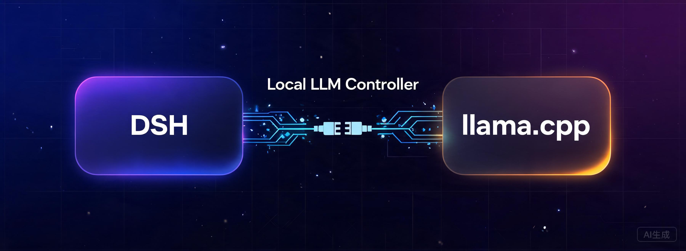
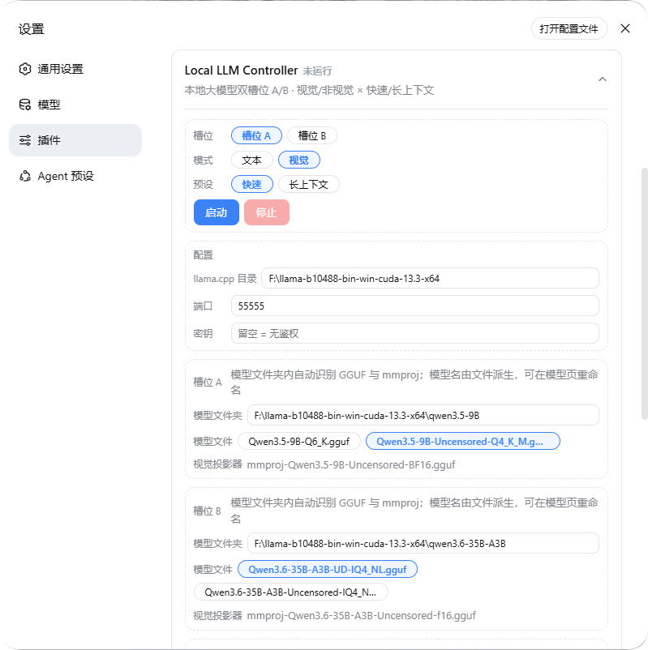
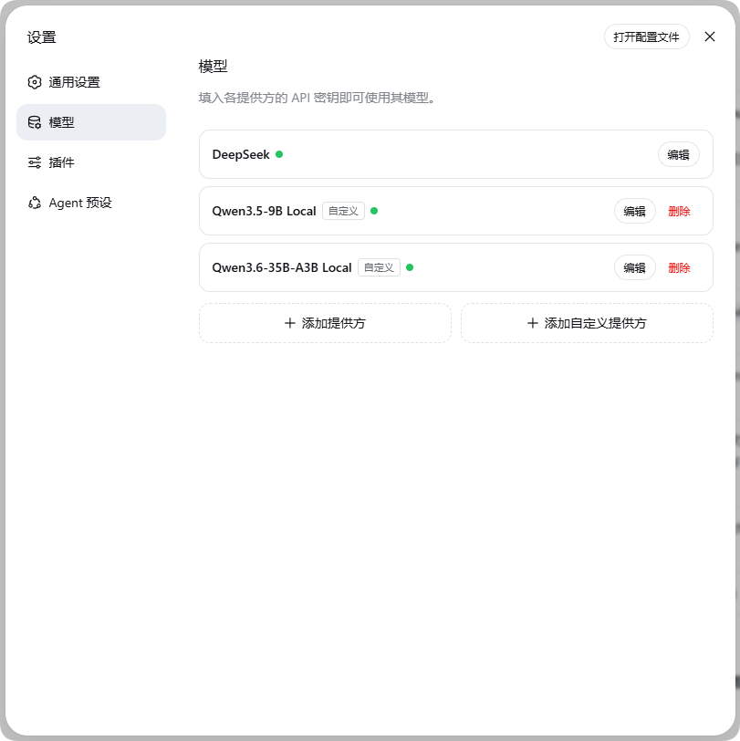
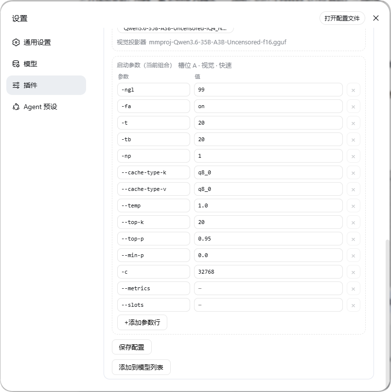
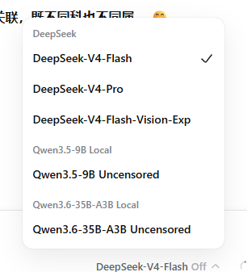

<div align="center">

# 🚀 dsh-local-llm-controller



**A DSH plugin: start/stop a local llama.cpp server from the settings page — make your local model the DSH session model**

[](https://www.npmjs.com/package/dsh-local-llm-controller)
[](https://github.com/Lbunc/dsh-local-llm-controller/blob/main/LICENSE)
[](https://github.com/ggml-org/llama.cpp)

**English** | [简体中文](README.md)

</div>

***

## ✨ Overview

Start/stop a local [llama.cpp](https://github.com/ggml-org/llama.cpp) `llama-server` right from the DSH (DeepSeek Harness) **Settings → Plugins** page, hooking your local model into DSH as a session model.

**Since v2.0**: no longer tied to specific models — two **model slots A/B** (each with its own folder and model file) and **8 editable launch-parameter groups** per slot (text/vision × fast/long-context). The model name and Provider key are derived from the chosen GGUF automatically; rename on the models page if you like.

> 🌐 Card copy follows the DSH Web language setting (简体中文 / English) — no extra configuration.

***

## 🆕 v2.0: usage after install

> Differences from v1.x: two fixed models (35B/9B) → **two slots A/B**; built-in presets → **8 editable launch-parameter rows**; model name/Provider key → derived from the file, renameable on the models page.

### Usage flow

1. **Open the card** and fill in the config area:
   - `llama.cpp directory`: where `llama-server.exe` lives (required)
   - `Port`: default 55555 (「Add to model list」writes the current value into the provider baseURL)
   - `API key`: blank = no auth (loopback only); a placeholder auth header is still written (pi-ai client requires one), and a set value is used on both sides

   <p align="center"></p>

2. **Slot A / B config**: enter a **model folder path** each (containing model GGUFs; add an mmproj for vision) → click **「Save config」**.
3. **Add the model to the model list**: after saving, all model GGUFs in the folder become bubbles (mmproj never appears — it is wired automatically in vision mode) → pick one → **「Save config」** → **「Add to model list」**. The model name is **derived** from the file name; rename / change the display name on **Settings → Models**.

   <p align="center"></p>

4. **Launch parameters** (8 groups = slot × text/vision × fast/long): the group being edited is shown as「Launch args (current combo)」; each row is a `flag` + `value` pair of inputs, with **+ add row** and **× delete row**. Basics are prefilled (`-ngl`/`-t`/`-c`/sampling…); see the [llama.cpp docs](https://github.com/ggml-org/llama.cpp) and the recommended sets below. `-m`/`-a`/`--port`/`--host`/`--api-key` and vision-mode `--mmproj` are managed automatically — never add them manually.

   <p align="center"></p>

5. **Launch zone**: choose slot A/B → mode (text/vision) → preset (fast/long) → click **「Start」**.
6. **Chat**: once the status turns Running, pick the local model at the bottom of a session; **「Stop」** releases the port; errors show the reason and recent logs on the card.

   <p align="center"></p>

### ⚠️ Notes

- **After switching the model file in the same slot**: the Provider Key changes with the file name — the old key in **Settings → Models** is **never overwritten/removed automatically**; delete the old entry manually, then click「Add to model list」to write the new one.
- **Vision images**: the image decoder of old llama-server builds **does not support WebP**. This plugin raises DSH's image-request budget to 16MiB / 4096², so regular **PNG/JPEG screenshots and large images pass through untouched**; **WebP source files** must be converted to PNG/JPEG first.
- The **mmproj** (vision projector) in the model folder is auto-detected and auto-attached in vision mode; its file name must contain `mmproj`.
- To pin a Provider Key (so switching model files does not break existing model selections): rename the model on **Settings → Models** — the plugin keeps using the derived key as-is; models-page edits do not write back into the plugin config.

> 🧩 This plugin only connects **DSH ↔ llama.cpp**: it ships neither `llama-server` nor models — those come from upstream [llama.cpp](https://github.com/ggml-org/llama.cpp) and community quantizations (e.g. Hugging Face).

***

## 📦 Installation

### One command (recommended)

```bash
# dsh is on PATH (globally installed @deepseek-ai/dsh)
dsh plugin --profile web add dsh-local-llm-controller

# when dsh CLI is not globally installed (@deepseek-ai/dsh not on PATH), use npx (bundled with Node, no extra install) to fetch the CLI on the fly:
npx @deepseek-ai/dsh plugin --profile web add dsh-local-llm-controller
```

Then **restart DSH Web** — the package declares `dsh.bundle`, registration is automatic, no manual config rows. The card appears at **Settings → Plugins → Local LLM Controller**.

### 🗑️ Uninstall

1. If a model is running, click **「Stop」** on the card first (optional — DSH reaps plugin children on restart).
2. One command removes it (registration auto-purged, no file edits):

   ```bash
   dsh plugin --profile web remove dsh-local-llm-controller
   ```

3. Restart DSH Web — the card disappears.

| Leftovers (optional cleanup) | Notes |
| --- | --- |
| `settings.yaml` `local-llm` section | Plugin state/config; harmless to keep, delete for a clean state |
| `llm-pi-ai.providers.*` (derived-key local entries) | **Keep recommended**: still usable when running the same port manually; delete if truly unused |
| `~/.dsh/local-llm.config.json` | Leftover from the old installer era, safe to delete |
| Model files / llama.cpp itself | Not the plugin's concern, keep |

***

## 📐 Recommended launch parameters (8 sets, v1.x measured baseline)

> Parameters the plugin manages automatically — never add them manually: `-m` / `-a` / `--port` / `--host` / `--api-key` (when a key is set) and vision-mode `--mmproj` / `--image-min-tokens`. Each line below is one set — paste it into the matching launch-parameter group, or use it to run `llama-server` manually.

**35B** (Qwen3.6-35B-A3B, MoE):

```
35B · text · fast        : -ngl 99 -fa on -t 20 -tb 20 -np 1 --cache-type-k q8_0 --cache-type-v q8_0 --temp 1.0 --top-k 20 --top-p 0.95 --min-p 0.0 -c 32768 -ncmoe 20 --reasoning-budget 2048 --metrics --slots
35B · text · long        : -ngl 99 -fa on -t 20 -tb 20 -np 1 --cache-type-k q8_0 --cache-type-v q8_0 --temp 1.0 --top-k 20 --top-p 0.95 --min-p 0.0 -c 131072 -ncmoe 22 --reasoning-budget 2048 --metrics --slots
35B · vision · fast      : -ngl 99 -fa on -t 20 -tb 20 -np 1 --cache-type-k q8_0 --cache-type-v q8_0 --temp 1.0 --top-k 20 --top-p 0.95 --min-p 0.0 -c 32768 -ncmoe 24 --reasoning-budget 2048 --metrics --slots
35B · vision · long      : -ngl 99 -fa on -t 20 -tb 20 -np 1 --cache-type-k q8_0 --cache-type-v q8_0 --temp 1.0 --top-k 20 --top-p 0.95 --min-p 0.0 -c 98304 -ncmoe 24 --reasoning-budget 2048 --metrics --slots
```

**9B** (Qwen3.5-9B, Dense):

```
9B · text · fast        : -ngl 99 -fa auto -t 20 -tb 20 -np 1 --cache-type-k q8_0 --cache-type-v q8_0 --temp 0.8 --top-k 40 --top-p 0.95 --min-p 0.05 -c 32768 --metrics --slots
9B · text · long        : -ngl 99 -fa auto -t 20 -tb 20 -np 1 --cache-type-k q8_0 --cache-type-v q8_0 --temp 0.8 --top-k 40 --top-p 0.95 --min-p 0.05 -c 65536 --metrics --slots
9B · vision · fast      : -ngl 99 -fa auto -t 20 -tb 20 -np 1 --cache-type-k q8_0 --cache-type-v q8_0 --temp 0.8 --top-k 40 --top-p 0.95 --min-p 0.05 -c 32768 --metrics --slots
9B · vision · long      : -ngl 99 -fa auto -t 20 -tb 20 -np 1 --cache-type-k q8_0 --cache-type-v q8_0 --temp 0.8 --top-k 40 --top-p 0.95 --min-p 0.05 -c 65536 --metrics --slots
```

> 📌 For the 35B, `-ncmoe` (MoE expert offload count) and `--reasoning-budget` are measured optimizations; reliable long-context ceilings are `-c 131072` (35B, ncmoe 22) / `-c 65536` (9B) — `-c 196608` is the hard cliff (KV spills into shared memory). For full measurements, model-selection conclusions, and the experiment methodology, see **Further reading** below.

***

## 📖 Further reading

- [Tuning Report Archive (35B / 9B / 27B)](docs/measurements/ctx_scan_report.md): Multi-model real-world measurements, tuning conclusions, hardware selection advice, and the long-context safe-ceiling summary.
- [**llm-experiment-design · DSH Tuning Skill**](docs/llm-experiment-design/SKILL.md): The Skill for deep-tuning a new GGUF — it schedules scripts and interprets results via the standard pipeline: runtime probing → necessity-gated scans → four-signal measurements → capability verification, and delivers a reproducible set of optimal launch parameters (MoE + dense both supported).

***

## 📄 License

[MIT](LICENSE)
