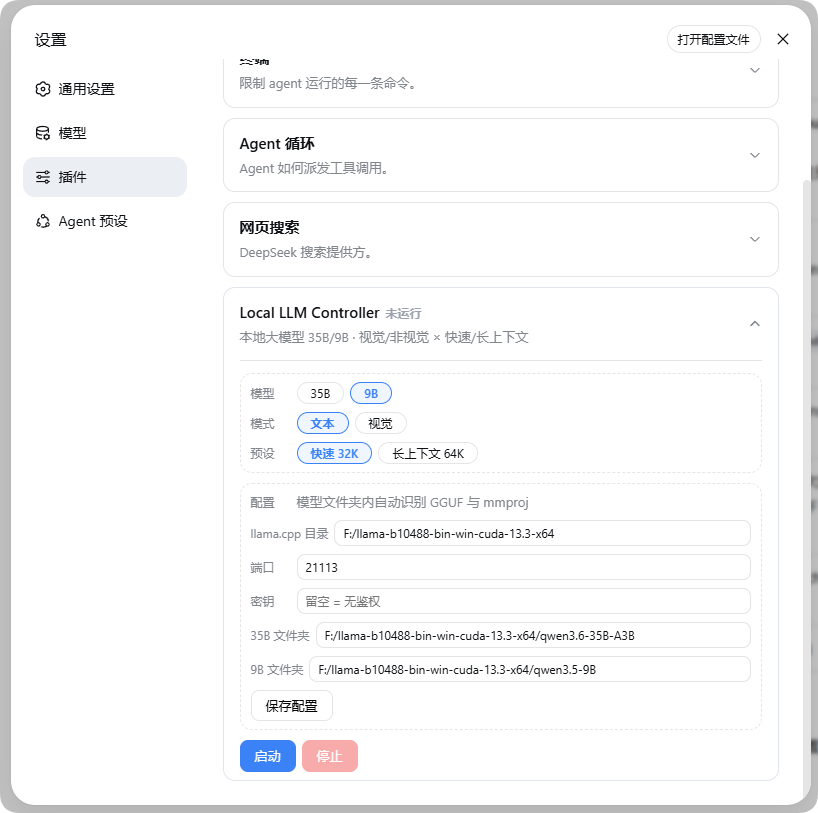
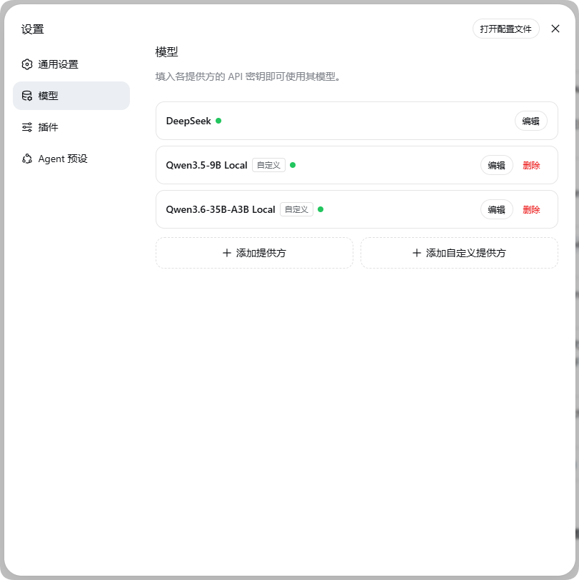
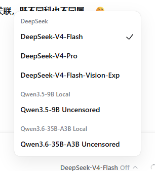

<div align="center">

# 🚀 dsh-local-llm-controller

**DSH 插件：设置页一键启停本地 llama.cpp，让本地大模型成为 DSH 会话模型**

[](https://www.npmjs.com/package/dsh-local-llm-controller)
[](https://github.com/Lbunc/dsh-local-llm-controller/blob/main/LICENSE)
[](https://github.com/ggml-org/llama.cpp)

[English](README.en.md) | **简体中文**

</div>

---

## ✨ 概览

在 DSH（DeepSeek Harness）的「设置 → 插件」页面一键启停本地 [llama.cpp](https://github.com/ggml-org/llama.cpp) `llama-server`，把本地大模型直接接入 DSH 作为会话模型。

<details>
<summary><b>支持矩阵（双模型 × 双模式 × 双预设）</b></summary>

| 模型 | 文本 / 快速 | 文本 / 长上下文 | 视觉 / 快速 | 视觉 / 长上下文 |
| --- | --- | --- | --- | --- |
| **Qwen3.6-35B-A3B**（IQ4_NL） | 32K | 128K | 32K + mmproj | 96K + mmproj |
| **Qwen3.5-9B**（Q4_K_M） | 32K | 64K | 32K + mmproj | 64K + mmproj |

</details>

**三步上手**：卡片里填好 `llama.cpp` 目录与端口 → 选模型/模式/预设 → 点「启动」。会话顶部选择本地模型即可对话；「停止」释放端口。状态（运行中 / 错误 / PID / 日志）实时显示在卡片上。

> 🌐 卡片界面文案跟随 DSH Web 的语言设置（简体中文 / English），无需额外配置。

| ① 设置 → 插件（配置卡片） | ② 设置 → 模型（添加到模型列表后出现） |
| :---: | :---: |
|  |  |

| ③ 会话模型选择器 |
| :---: |
|  |

> 🧩 本插件只负责 **DSH ↔ llama.cpp 的连接与控制**：不包含 `llama-server` 本体，也不负责下载模型——分别来自上游 [llama.cpp](https://github.com/ggml-org/llama.cpp) 与社区量化发布（如 Hugging Face）。

---

## 🖥️ 环境需求

| 项 | 要求 |
| --- | --- |
| **DSH** | ≥ 0.1.0-rc.7，含 web profile |
| **llama.cpp** | `llama-server` 可执行文件（作者验证 0.1.2-dev build 10488，CUDA 13.3 构建；CPU 构建也能跑 9B，配置 `ngl: 0`） |
| **模型文件** | 两个 GGUF + 两个 mmproj（路径在卡片里配） |
| **硬件** | 作者环境 RTX 4070 SUPER 12GB + 32GB 内存（i5-13600KF）；128K 长上下文需充足内存 |
| **系统** | Windows 为主（Linux/macOS 把 `serverExe` 改为 `llama-server`） |

**推荐模型文件**（体积参考）：

| 文件 | 用途 | 体积 |
| --- | --- | --- |
| `Qwen3.6-35B-A3B`（IQ4_NL GGUF） | 35B 主模型 | ~20GB |
| `mmproj`（Qwen3.6-35B-A3B） | 35B 视觉投影 | ~1.5GB |
| `Qwen3.5-9B`（Q4_K_M GGUF） | 9B 主模型 | ~6GB |
| `mmproj`（Qwen3.5-9B） | 9B 视觉投影 | ~700MB |

---

## 📦 安装

### 方式一：一条命令（推荐）

```bash
# dsh 已在环境变量（全局安装过 @deepseek-ai/dsh）
dsh plugin --profile web add dsh-local-llm-controller

# dsh 不在环境变量时（平时用 dlx/npx 临时运行 DSH），等价命令：
pnpm dlx @deepseek-ai/dsh plugin --profile web add dsh-local-llm-controller
```

装完**重启 DSH Web** 即可——本包声明了 `dsh.bundle`，安装时 DSH 自动完成注册，**无需手动添加任何配置行**。

### ✏️ 第一次使用（全部在卡片里，不碰文件）

1. 打开 **设置 → 插件 → Local LLM Controller**，展开卡片。
2. 在「配置」区填好：

   | 表单项 | 说明 |
   | --- | --- |
   | `llama.cpp 目录` | `llama-server.exe` 所在文件夹（必填） |
   | `端口` | 默认 55555；「添加到模型列表」按当前值写入 provider 的 baseURL |
   | `密钥` | 留空 = 无鉴权（仅回环 127.0.0.1）；留空也会写入占位鉴权头（pi-ai 客户端要求），填了则两边一致 |
   | `35B / 9B 文件夹` | 各模型所在文件夹；默认 `llama.cpp 目录\qwen3.6-35B-A3B` 与 `...\qwen3.5-9B` |

   > 🔍 模型文件夹内**自动识别**：文件名含 `mmproj` 的是视觉投影，其余一个是主模型——文件名、量化后缀都不影响。

3. 「保存配置」→ 点「**添加到模型列表**」（把两个 Qwen 服务商写入 设置 → 模型，即时生效）→ 选模型（35B/9B）、模式（文本/视觉）、预设（快速/长上下文）→ 「启动」（首次加载 40~90s 属正常）。
4. 状态变「运行中」后，会话里选 **Qwen3.5-9B Local** 或 **Qwen3.6-35B-A3B Local** 即可对话。
5. 「停止」释放端口；出错时卡片会显示原因和最近日志。

> ⚙️ 高级参数（`ngl`、线程数、模型别名、provider 自定义等）仍可通过 `settings.yaml` 的 `local-llm.config` 段配置，字段见源码注释。

### 🗑️ 卸载

1. 模型在运行就先在卡片点「停止」（不点也行——DSH 重启时插件自行清理子进程）。
2. 一条命令卸载（注册自动移除，无需改文件）：

   ```bash
   dsh plugin --profile web remove dsh-local-llm-controller
   ```

3. 重启 DSH Web，卡片即消失。

| 卸载后的残留（可选清理） | 说明 |
| --- | --- |
| `settings.yaml` 的 `local-llm` 段 | 插件写的状态/配置，留着无害，想干净就删 |
| `llm-pi-ai.providers.qwen36-local / qwen35-local` | **建议保留**：改用手动方式跑同端口服务时仍可用；确实不用再删 |
| `~/.dsh/local-llm.config.json` | 旧安装脚本时代的遗留，可删 |
| 模型文件 / llama.cpp 本体 | 与插件无关，保留 |

---

## 🧪 测试环境

| 项 | 值 |
| --- | --- |
| GPU | RTX 4070 SUPER 12GB（12282 MiB） |
| CPU | i5-13600KF（6P + 8E，20 线程） |
| 内存 | 32GB |
| llama.cpp | 0.1.2-dev（build 10488），CUDA 13.3 构建 |
| DSH | 0.1.0-rc.7（web profile） |
| 模型 | Qwen3.6-35B-A3B（IQ4_NL，18.4GB）+ f16 mmproj；Qwen3.5-9B（Q4_K_M）+ BF16 mmproj |
| 方法 | 干净环境复测：`/health` + `/props`（鉴权）确认就绪，`/completion` 深填充测速，nvidia-smi 采样显存与 GPU 利用率 |

---

## 📊 简要数据与结论（35B 实测）

| 配置 | 空闲 shared (MiB) | 大图编码 | 深填充速度 | 结论 |
| --- | --- | --- | --- | --- |
| ncmoe 20 @ 32K | ~150 | — | ~70 t/s | ✅ 基准：远离溢出点，全程不掉速 |
| ncmoe 20 @ 80K | **303** | — | 63.5 t/s | ⚠️ KV 开始溢出共享内存，不再建议 |
| ncmoe 22 @ 128K | 227~260 | — | 45~54 t/s | 📌 长上下文档：ncmoe 22 的可靠上限（196608 是硬断崖） |
| **ncmoe 24 @ 32K 视觉** | 132~149 | **11.8s** | 62 t/s | 🏆 视觉最优：mmproj 完整进 GPU |
| **ncmoe 24 @ 96K 视觉** | 198 | **15.2s** | 49.5 t/s | 🏆 综合最优：3× 上下文 + 可用图片速度 |

**结论**：KV 缓冲按层分配，权重 + KV 超 12GB 时部分 KV 层落共享内存，生成时每步跨 PCIe 读 KV → 速度骤降，**空闲 shared 值是最可靠的溢出信号**。档位取舍：文本 32K 稳妥 / 长上下文 128K = ncmoe 22 上限 / 视觉必须 ncmoe 24。掉速曲线（74→70→63→60→54 t/s，随填充 40k→53k→70k→88k→119k 增长）是模型特性，任何配置都躲不开。

📚 完整报告、原始数据与测试脚本（脱敏版）见 [docs/measurements/](docs/measurements/)。

---

## 📄 License

[MIT](LICENSE)
