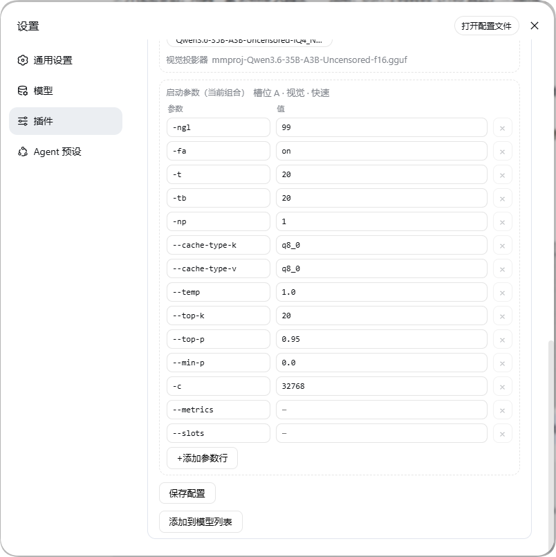

<div align="center">

# 🚀 dsh-local-llm-controller

**DSH 插件：设置页一键启停本地 llama.cpp，让本地大模型成为 DSH 会话模型**

[](https://www.npmjs.com/package/dsh-local-llm-controller)
[](https://github.com/Lbunc/dsh-local-llm-controller/blob/main/LICENSE)
[](https://github.com/ggml-org/llama.cpp)

[English](README.en.md) | **简体中文**

</div>

---

## ✨ 概览

在 DSH（DeepSeek Harness）的「设置 → 插件」页面一键启停本地 [llama.cpp](https://github.com/ggml-org/llama.cpp) `llama-server`，把本地大模型直接接入 DSH 作为会话模型。

**v2.0 起**：不再绑定特定模型——两个**模型槽位 A/B**（各选各的文件夹与模型文件）、每个槽位 **8 组可编辑启动参数**（文本/视觉 × 快速/长上下文），模型名与 Provider 键由所选 GGUF 自动派生，模型页可重命名。

> 🌐 卡片界面文案跟随 DSH Web 的语言设置（简体中文 / English），无需额外配置。

---

## 🆕 v2.0：安装后的使用流程

> 与 v1.x 的差异：双模型（35B/9B）→ **双槽位 A/B**；内建预设 → **8 组可编辑启动参数行**；模型名/Provider 键 → 文件派生、模型页可改名。

### 安装

```bash
dsh plugin --profile web add dsh-local-llm-controller
```

装完**重启 DSH Web**（本包声明了 `dsh.bundle`，注册自动完成，无需手动配置）。卡片出现在 **设置 → 插件 → Local LLM Controller**。

### 使用流程

1. **展开卡片**，在配置区填：
   - `llama.cpp 目录`：`llama-server.exe` 所在文件夹（必填）
   - `端口`：默认 55555（「添加到模型列表」按当前值写入 provider 的 baseURL）
   - `密钥`：留空 = 无鉴权（仅回环）；留空也会写入占位鉴权头（pi-ai 客户端要求）

2. **槽位 A / B 配置**：各填一个**模型文件夹**（内含模型 GGUF，含视觉的还要有 mmproj）→ 点「**保存配置**」。

3. **选模型文件**：保存后文件夹内所有模型 GGUF 变成气泡（mmproj 不会出现在列表，视觉时自动挂载）→ 点选一个。模型名由文件名**自动派生**；要改名/改显示名去 **设置 → 模型** 页改。

4. **启动参数**（8 组 = 槽位 × 文本/视觉 × 快速/长上下文）：「启动参数（当前组合）」显示正在编辑哪一组，每行 = `参数` + `值` 两个输入框，支持 **+ 添加参数行** 与 × **删除行**。基础参数已预填（`-ngl`/`-t`/`-c`/采样…），推荐的高级参数组合见项目文档与 [llama.cpp 参数](https://github.com/ggml-org/llama.cpp)；`-m`/`-a`/`--port`/`--host`/`--api-key` 及视觉时的 `--mmproj` 由插件自动管理，无需在参数行里添加。

5. **启动区**：选槽位 A/B → 选模式（文本/视觉）→ 选预设（快速/长上下文）→ 点「**添加到模型列表**」（写入 **设置 → 模型**，即时生效）→ 点「**启动**」（首次加载 40~90s 属正常）。

6. **对话**：状态变「运行中」后，会话顶部选择对应的本地模型即可；「停止」释放端口；出错时卡片显示原因与最近日志。

| ① 设置 → 插件（配置卡片） | ② 启动参数行（8 组之一） |
| :---: | :---: |
|  |  |

| ③ 设置 → 模型（添加到模型列表后出现） |
| :---: |
|  |

### ⚠️ 注意事项

- **换模型文件后**：Provider 键随文件名变化——旧键在「设置 → 模型」里**不会自动覆写/删除**，需要**手动删除旧条目**后，再点「添加到模型列表」写入新条目。
- **视觉图片**：llama-server（旧构建）的图片解码器**不支持 WebP**。本插件已把 DSH 的图片请求预算提高到 16MiB / 4096²，常规 **PNG/JPEG 截图/大图会原样直达**；**WebP 源文件**请先转成 PNG/JPEG 再发。
- 模型文件夹里的 **mmproj**（视觉投影器）自动识别、视觉模式自动挂载，且必须在文件名中包含 `mmproj`。
- 想固定 Provider 键（免去每次换文件后重选模型）：在「设置 → 模型」里把对应模型改名后，插件内使用派生键即可——模型页的修改不回写插件配置。

> 🧩 本插件只负责 **DSH ↔ llama.cpp 的连接与控制**：不包含 `llama-server` 本体，也不负责下载模型——分别来自上游 [llama.cpp](https://github.com/ggml-org/llama.cpp) 与社区量化发布（如 Hugging Face）。

---

## 🖥️ 环境需求

| 项 | 要求 |
| --- | --- |
| **DSH** | ≥ 0.1.0-rc.7，含 web profile |
| **llama.cpp** | `llama-server` 可执行文件（作者验证 0.1.2-dev build 10488，CUDA 13.3 构建；CPU 构建也能跑小模型） |
| **模型文件** | 每个槽位一个模型 GGUF；视觉再配同文件夹 mmproj（文件名含 `mmproj`） |
| **硬件** | 作者环境 RTX 4070 SUPER 12GB + 32GB 内存（i5-13600KF）；长上下文需充足内存 |
| **系统** | Windows 为主（Linux/macOS 把 `serverExe` 改为 `llama-server`） |

**推荐模型文件**（v1.x 实测基准，体积参考）：

| 文件 | 用途 | 体积 |
| --- | --- | --- |
| `Qwen3.6-35B-A3B`（IQ4_NL GGUF） | 35B 主模型 | ~20GB |
| `mmproj`（Qwen3.6-35B-A3B） | 35B 视觉投影 | ~1.5GB |
| `Qwen3.5-9B`（Q4_K_M GGUF） | 9B 主模型 | ~6GB |
| `mmproj`（Qwen3.5-9B） | 9B 视觉投影 | ~700MB |

---

## 📦 安装

### 方式一：一条命令（推荐）

```bash
# dsh 已在环境变量（全局安装过 @deepseek-ai/dsh）
dsh plugin --profile web add dsh-local-llm-controller

# dsh 不在环境变量时（平时用 dlx/npx 临时运行 DSH），等价命令：
pnpm dlx @deepseek-ai/dsh plugin --profile web add dsh-local-llm-controller
```

### 🗑️ 卸载

1. 模型在运行就先在卡片点「停止」（不点也行——DSH 重启时插件自行清理子进程）。
2. 一条命令卸载（注册自动移除，无需改文件）：

   ```bash
   dsh plugin --profile web remove dsh-local-llm-controller
   ```

3. 重启 DSH Web，卡片即消失。

| 卸载后的残留（可选清理） | 说明 |
| --- | --- |
| `settings.yaml` 的 `local-llm` 段 | 插件写的状态/配置，留着无害，想干净就删 |
| `llm-pi-ai.providers.*`（派生键的本地条目） | **建议保留**：改用手动方式跑同端口服务时仍可用；确实不用再删 |
| `~/.dsh/local-llm.config.json` | 旧安装脚本时代的遗留，可删 |
| 模型文件 / llama.cpp 本体 | 与插件无关，保留 |

---

## 🧪 测试环境与实测数据（v1.x 基准）

| 项 | 值 |
| --- | --- |
| GPU | RTX 4070 SUPER 12GB（12282 MiB） |
| CPU | i5-13600KF（6P + 8E，20 线程） |
| 内存 | 32GB |
| llama.cpp | 0.1.2-dev（build 10488），CUDA 13.3 构建 |
| DSH | 0.1.0-rc.7 → 0.1.1-rc.2 |
| 模型 | Qwen3.6-35B-A3B（IQ4_NL，18.4GB）+ f16 mmproj；Qwen3.5-9B（Q4_K_M）+ BF16 mmproj |

**35B 实测（上下文/视觉档位）**：

| 配置 | 空闲 shared (MiB) | 大图编码 | 深填充速度 | 结论 |
| --- | --- | --- | --- | --- |
| ncmoe 20 @ 32K | ~150 | — | ~70 t/s | ✅ 基准：远离溢出点，全程不掉速 |
| ncmoe 20 @ 80K | **303** | — | 63.5 t/s | ⚠️ KV 开始溢出共享内存，不再建议 |
| ncmoe 22 @ 128K | 227~260 | — | 45~54 t/s | 📌 长上下文档：ncmoe 22 的可靠上限（196608 是硬断崖） |
| **ncmoe 24 @ 32K 视觉** | 132~149 | **11.8s** | 62 t/s | 🏆 视觉最优：mmproj 完整进 GPU |
| **ncmoe 24 @ 96K 视觉** | 198 | **15.2s** | 49.5 t/s | 🏆 综合最优：3× 上下文 + 可用图片速度 |

**结论**：KV 缓冲按层分配，权重 + KV 超 12GB 时部分 KV 层落共享内存，生成时每步跨 PCIe 读 KV → 速度骤降，**空闲 shared 值是最可靠的溢出信号**。完整报告、原始数据与测试脚本（脱敏版）见 [docs/measurements/](docs/measurements/)。

---

## 📄 License

[MIT](LICENSE)
