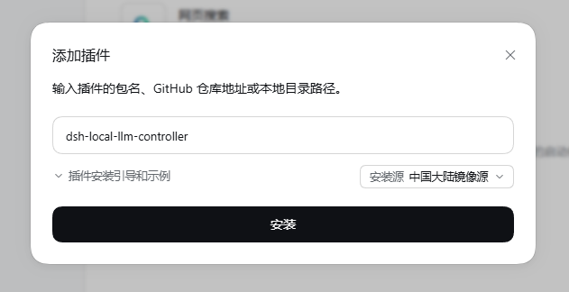

<div align="center">

# 🚀 dsh-local-llm-controller


**DSH 插件：设置页一键启停本地 llama.cpp，让本地大模型成为 DSH 会话模型**

配置卡片位于 设置 → 插件 → 本地大模型控制器

[English](README.en.md) | **简体中文**

[](https://www.npmjs.com/package/dsh-local-llm-controller)
[](https://github.com/Lbunc/dsh-local-llm-controller/blob/main/LICENSE)
[](https://github.com/ggml-org/llama.cpp)
[](https://www.npmjs.com/package/@deepseek-ai/dsh)

</div>

***

> ⚠️ **DSH 0.1.7-rc.1 经过巨大底层改动，本插件仅 v2.1.0 以上版本适配（只适配 RC 正式分支，其他分支不保证兼容）。**

## ✨ 特性

- ⚡ **一键启停本地 `llama-server`**：「设置 → 插件」卡片直接启动 / 停止，状态、出错原因与最近日志同卡显示；DSH 重启时插件自行清理子进程
- 📁 **槽位 A / B 双模型文件夹**：自动扫描文件夹内所有模型 GGUF 生成可选列表；**mmproj**（视觉投影器）自动识别、视觉模式自动挂载
- 🎛️ **8 组启动参数**（槽位 × 文本/视觉 × 快速/长上下文）：每行 `参数 + 值` 自由增删，基础参数预填；`-m` / `-a` / `--port` / `--host` / `--api-key` 与视觉的 `--mmproj` 由插件自动管理
- 🧩 **一键接入会话**：「添加到模型列表」把选中的模型写入 DSH 模型页（provider `dsh-local`），会话底部即可选用本地模型对话

> 🧩 本插件只负责 **DSH ↔ llama.cpp 的连接与控制**：不包含 `llama-server` 本体，也不负责下载模型——分别来自上游 [llama.cpp](https://github.com/ggml-org/llama.cpp) 与社区量化发布（如 Hugging Face）。

## 🚀 快速开始

### 安装

**DSH内置插件管理器（推荐）**：侧边栏 **设置 → 插件 → 添加插件**，输入下表任意一种地址 → 选择安装源 → **安装** → 启用，装完**无需重启 DSH Web**。

**命令行**：`dsh plugin --profile web add "<地址>"`（升级 = 重新执行同一条命令，已是最新时提示 `Already up to date`）

| 地址形式 | 说明 |
| :- | :- |
| `dsh-local-llm-controller` | 包名，从 npm registry 安装最新发布版 |
| `D:\path\to\dsh-local-llm-controller` | 本地文件夹。link 活链，开发调试首选，`git pull` 后重启 DSH 生效 |
| `D:\path\to\dsh-local-llm-controller-2.1.0.tgz` | releases .tgz 包 |
| `https://github.com/Lbunc/dsh-local-llm-controller` | GitHub 仓库。装远程最新推送，可能不稳定 |

<p align="center"></p>

> [!TIP]
> - 🛠️ `dsh` 不在 PATH（未全局安装 `@deepseek-ai/dsh`）时，用 Node 自带的 npx 临时拉取 CLI：`npx @deepseek-ai/dsh plugin --profile web add dsh-local-llm-controller`
> - 🔍 先看有没有新版：`dsh plugin --profile web outdated`（无输出 = 已是最新）；装指定版本：`dsh plugin --profile web add dsh-local-llm-controller@2.1.0`
> - 📦 安装/升级时若出现 `Issues with peer dependencies found` 警告属正常现象（本插件的 peer 由 DSH 宿主提供，不随包安装），不影响使用。

### 使用流程

1. **展开卡片**，在配置区填：
   - `llama.cpp 目录`：`llama-server.exe` 所在文件夹（必填）
   - `端口`：默认 55555（「添加到模型列表」按当前值写入 provider 的 baseURL）
   - `密钥`：留空 = 无鉴权（仅回环）；留空也会写入占位鉴权头（pi-ai 客户端要求）

   <p align="center"></p>

2. **槽位 A / B 配置**：各填一个**模型文件夹路径**（内含模型 GGUF，含视觉的还要有 mmproj）→ 点「**保存配置**」。
3. **添加模型到模型列表**：保存后文件夹内所有模型 GGUF 变成气泡（mmproj 不会出现在列表，视觉时自动挂载）→ 点选一个 → 点「**保存配置**」→ 点「**添加到模型列表**」。模型名由文件名**自动派生**；要改名/改显示名去 **设置 → 模型** 页改。

   <p align="center"></p>

4. **启动参数**（8 组 = 槽位 × 文本/视觉 × 快速/长上下文）：「启动参数（当前组合）」显示正在编辑哪一组，每行 = `参数` + `值` 两个输入框，支持 **+ 添加参数行** 与 × **删除行**。基础参数已预填（`-ngl`/`-t`/`-c`/采样…），推荐的高级参数组合见下方「📐 推荐启动参数」与 [llama.cpp 参数](https://github.com/ggml-org/llama.cpp)；`-m`/`-a`/`--port`/`--host`/`--api-key` 及视觉时的 `--mmproj` 由插件自动管理，无需在参数行里添加。

   <p align="center"></p>

5. **启动区**：选槽位 A/B → 选模式（文本/视觉）→ 选预设（快速/长上下文）→ 点「**启动**」
6. **对话**：状态变「运行中」后，会话底部选择对应的本地模型即可；「停止」释放端口；出错时卡片显示原因与最近日志。

   <p align="center"></p>

### ⚠️ 注意事项

- **同一插槽换模型文件后**：Provider Key 随文件名变化——旧键在「设置 → 模型」里**不会自动覆写/删除**，需要**手动删除旧条目**后，再点「添加到模型列表」写入新条目。
- **视觉图片**：llama-server（旧构建）的图片解码器**不支持 WebP**。本插件已把 DSH 的图片请求预算提高到 16MiB / 4096²，常规 **PNG/JPEG 截图/大图会原样直达**；**WebP 源文件**请先转成 PNG/JPEG 再发。
- 模型文件夹里的 **mmproj**（视觉投影器）自动识别、视觉模式自动挂载，且必须在文件名中包含 `mmproj`。
- 想固定 Provider Key（免去每次换文件后重选模型）：在「设置 → 模型」里把对应模型改名后，插件内使用派生键即可——模型页的修改不回写插件配置。

### 卸载

1. **卸载前**：模型在运行就先在卡片点「停止」（不点也行——DSH 重启时插件自行清理子进程）；若已把「默认模型」或某个预设设成本地模型（provider `dsh-local`），先改回云端模型再卸载，否则默认模型悬空。
2. **插件管理器**：插件行上的 **卸载** 按钮；**命令行**：`dsh plugin --profile web remove dsh-local-llm-controller`（bundle 注册与 `link:` 依赖自动移除）
3. 刷新页面，卡片即消失（无需重启 DSH）。

卸载命令会自动清掉 profile 的 bundle 注册和依赖（`profiles/web/package.json`、`pnpm-lock.yaml`），以下内容**不会**被自动删除（v2.1.0 / DSH 0.1.7-rc.1 实测）：

| 卸载后的残留（可选清理）                                                     | 说明                                                      |
| ---------------------------------------------------------------- | ------------------------------------------------------- |
| `~/.dsh/local-llm.config.json`                                   | **卡片配置**（llama.cpp 目录、端口与 8 组启动参数）。打算重装就别删；彻底弃用再删       |
| `llm-pi-ai.providers.dsh-local`（`profiles/web/cordis.patch.yml`） | 「添加到模型列表」写入的模型页条目；改手动跑同端口服务时仍可用，不用就删                    |
| `pnpm-workspace.yaml` 的版本豁免行                                     | remove 不回收的一行安装元数据（`dsh-local-llm-controller@…`），无害，可不管 |

> [!NOTE]
> 🔄 **从 v2.0.x 升级的用户**：旧版写在 `settings.yaml` 的 `local-llm` 段已随 DSH 0.1.7 的一次性导入改名进 `settings.yaml.imported`，无程序再读它，不用处理。

## 📐 推荐启动参数（8 套，v1.x 实测基准）

> 插件自动管理的参数无需手动添加：`-m` / `-a` / `--port` / `--host` / `--api-key`（有密钥时），以及视觉模式的 `--mmproj` / `--image-min-tokens`。下面每行一套，按「当前组合」粘贴进对应启动参数组即可；也可用于手动运行 `llama-server`。

**35B**（Qwen3.6-35B-A3B，MoE）：

```
35B · 文本 · 快速    : -ngl 99 -fa on -t 20 -tb 20 -np 1 --cache-type-k q8_0 --cache-type-v q8_0 --temp 1.0 --top-k 20 --top-p 0.95 --min-p 0.0 -c 32768 -ncmoe 20 --reasoning-budget 2048 --metrics --slots
35B · 文本 · 长上下文 : -ngl 99 -fa on -t 20 -tb 20 -np 1 --cache-type-k q8_0 --cache-type-v q8_0 --temp 1.0 --top-k 20 --top-p 0.95 --min-p 0.0 -c 131072 -ncmoe 22 --reasoning-budget 2048 --metrics --slots
35B · 视觉 · 快速    : -ngl 99 -fa on -t 20 -tb 20 -np 1 --cache-type-k q8_0 --cache-type-v q8_0 --temp 1.0 --top-k 20 --top-p 0.95 --min-p 0.0 -c 32768 -ncmoe 24 --reasoning-budget 2048 --metrics --slots
35B · 视觉 · 长上下文 : -ngl 99 -fa on -t 20 -tb 20 -np 1 --cache-type-k q8_0 --cache-type-v q8_0 --temp 1.0 --top-k 20 --top-p 0.95 --min-p 0.0 -c 98304 -ncmoe 24 --reasoning-budget 2048 --metrics --slots
```

**9B**（Qwen3.5-9B，Dense）：

```
9B · 文本 · 快速    : -ngl 99 -fa auto -t 20 -tb 20 -np 1 --cache-type-k q8_0 --cache-type-v q8_0 --temp 0.8 --top-k 40 --top-p 0.95 --min-p 0.05 -c 32768 --metrics --slots
9B · 文本 · 长上下文 : -ngl 99 -fa auto -t 20 -tb 20 -np 1 --cache-type-k q8_0 --cache-type-v q8_0 --temp 0.8 --top-k 40 --top-p 0.95 --min-p 0.05 -c 65536 --metrics --slots
9B · 视觉 · 快速    : -ngl 99 -fa auto -t 20 -tb 20 -np 1 --cache-type-k q8_0 --cache-type-v q8_0 --temp 0.8 --top-k 40 --top-p 0.95 --min-p 0.05 -c 32768 --metrics --slots
9B · 视觉 · 长上下文 : -ngl 99 -fa auto -t 20 -tb 20 -np 1 --cache-type-k q8_0 --cache-type-v q8_0 --temp 0.8 --top-k 40 --top-p 0.95 --min-p 0.05 -c 65536 --metrics --slots
```

> 📌 35B 的 `-ncmoe`（MoE 专家卸载数）与 `--reasoning-budget` 为实测优化项；长上下文可靠上限 `-c 131072`（35B，ncmoe 22）/ `-c 65536`（9B）——`-c 196608` 是硬断崖（KV 溢出共享内存）。更完整的实测数据、选型结论与实验方法见下方「推荐阅读」。

## 📚 推荐阅读

- [本地模型调优全历程终版存档](docs/measurements/ctx_scan_report.md)：35B / 9B / 27B 多模型实测对比、调优结论、选型建议与长上下文安全上限汇总。
- **[llm-experiment-design · DSH 调优 Skill](docs/llm-experiment-design/SKILL.md)**：给新 GGUF 做深度调优用的 Skill——按「运行时探查 → 必要性驱动扫描 → 四件套测量 → 能力验证」流程安排脚本与判读，最终输出一套可复现的最优启动参数（MoE/dense 通用）。

## 📄 许可

<div align="center">

[MIT](LICENSE)

</div>
