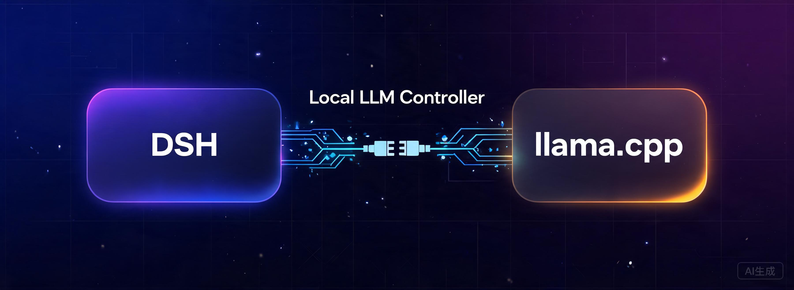
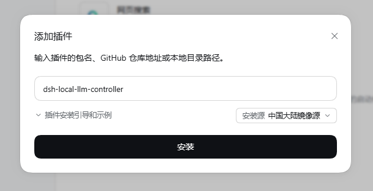
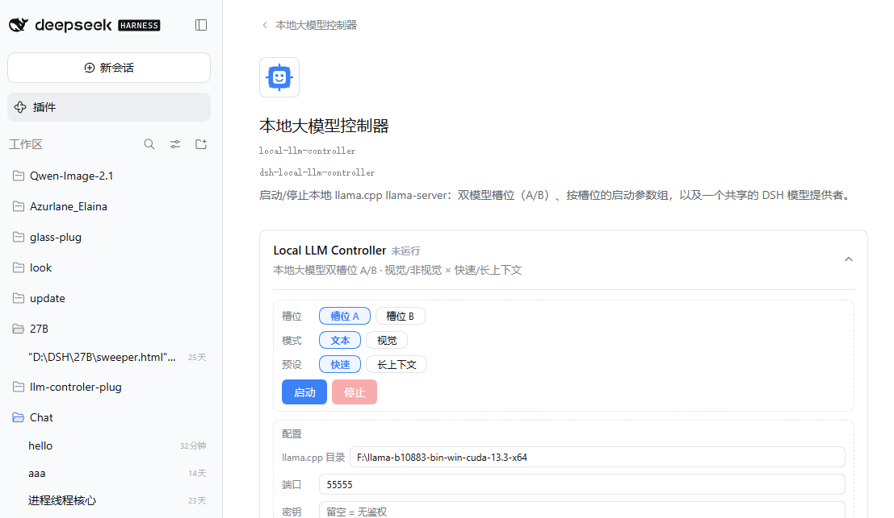
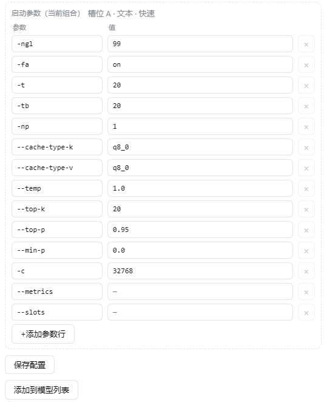
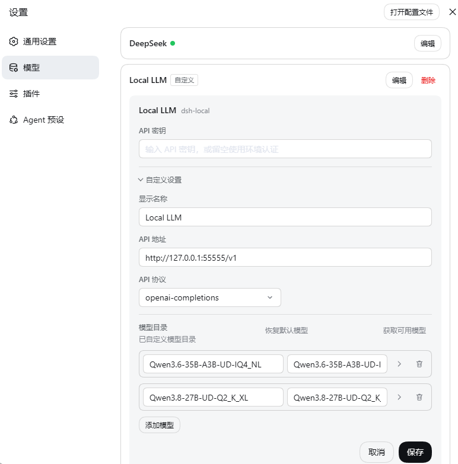
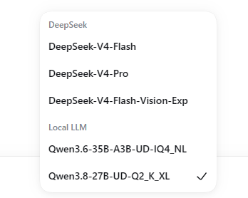

<div align="center">

# 🚀 dsh-local-llm-controller



**DSH 插件：设置页一键启停本地 llama.cpp，让本地大模型成为 DSH 会话模型**

配置卡片位于 设置 → 插件 → 本地大模型控制器

[English](README.en.md) | **简体中文**

[](https://www.npmjs.com/package/dsh-local-llm-controller)
[](https://github.com/Lbunc/dsh-local-llm-controller/blob/main/LICENSE)
[](https://github.com/ggml-org/llama.cpp)
[](https://www.npmjs.com/package/@deepseek-ai/dsh)
[](https://github.com/topics/dsh-plugin)

</div>

***

> ⚠️ **DSH 0.1.7-rc.1 经过巨大底层改动，本插件仅 v2.1.0 以上版本适配（只适配 RC 正式分支，其他分支不保证兼容）。**

## ✨ 特性

- ⚡ **一键启停本地 `llama-server`**：「设置 → 插件」卡片直接启动 / 停止，状态、出错原因与最近日志同卡显示；DSH 重启时插件自行清理子进程
- 📁 **槽位 A / B 双模型文件夹**：自动扫描文件夹内所有模型 GGUF 生成可选列表；**mmproj**（视觉投影器）自动识别、视觉模式自动挂载
- 🎛️ **8 组启动参数**（槽位 × 文本/视觉 × 快速/长上下文）：每行 `参数 + 值` 自由增删，基础参数预填；`-m` / `-a` / `--port` / `--host` / `--api-key` 与视觉的 `--mmproj` 由插件自动管理
- 🧩 **一键接入会话**：「添加到模型列表」把选中的模型写入 DSH 模型页（provider `dsh-local`），会话底部即可选用本地模型对话
- 🗜️ **本地压缩引擎（v2.2.0）**：子路径导出 `dsh-local-llm-controller/compaction` 替换内置 `dsh-compaction-basic`——比例阈值（约 70% 窗口触发）+ 尾巴封顶 + 三级摘要降级，根治本地小窗口（32k~150k）压缩失效与二次触发，详见「🗜️ 本地压缩引擎」

> 🧩 本插件只负责 **DSH ↔ llama.cpp 的连接与控制**：不包含 `llama-server` 本体，也不负责下载模型——分别来自上游 [llama.cpp](https://github.com/ggml-org/llama.cpp) 与社区量化发布（如 Hugging Face）。

## 🚀 快速开始

### 安装

**DSH内置插件管理器（推荐）**：侧边栏 **设置 → 插件 → 添加插件**，输入下表任意一种地址 → 选择安装源 → **安装** → 启用，装完**无需重启 DSH Web**。

**命令行**：`dsh plugin --profile web add "<地址>"`（升级 = 重新执行同一条命令，已是最新时提示 `Already up to date`）

| 地址形式 | 说明 |
| :- | :- |
| `dsh-local-llm-controller` | 包名，从 npm registry 安装最新发布版 |
| `D:\path\to\dsh-local-llm-controller` | 本地文件夹。link 活链，开发调试首选，`git pull` 后重启 DSH 生效 |
| `D:\path\to\dsh-local-llm-controller-2.2.0.tgz` | releases .tgz 包 |
| `https://github.com/Lbunc/dsh-local-llm-controller` | GitHub 仓库。装远程最新推送，可能不稳定 |

<p align="center"></p>

> [!TIP]
> - 🛠️ `dsh` 不在 PATH（未全局安装 `@deepseek-ai/dsh`）时，用 Node 自带的 npx 临时拉取 CLI：`npx @deepseek-ai/dsh plugin --profile web add dsh-local-llm-controller`
> - 🔍 先看有没有新版：`dsh plugin --profile web outdated`（无输出 = 已是最新）；装指定版本：`dsh plugin --profile web add dsh-local-llm-controller@2.2.0`
> - 📦 安装/升级时若出现 `Issues with peer dependencies found` 警告属正常现象（本插件的 peer 由 DSH 宿主提供，不随包安装），不影响使用。

### 使用流程

1. **打开配置区**，填：
   - `llama.cpp 目录`：`llama-server.exe` 所在文件夹（必填）
   - `端口`：默认 55555（「添加到模型列表」按当前值写入 provider 的 baseURL）
   - `密钥`：留空 = 无鉴权（仅回环）；留空也会写入占位鉴权头（pi-ai 客户端要求）

   <p align="center"></p>

2. **槽位 A / B 配置**：各填一个**模型文件夹路径**（内含模型 GGUF，含视觉的还要有 mmproj）→ 点「**保存配置**」。
3. **添加模型到模型列表**：保存后文件夹内所有模型 GGUF 变成气泡（mmproj 不会出现在列表，视觉时自动挂载）→ 点选一个 → 点「**保存配置**」→ 点「**添加到模型列表**」。模型名由文件名**自动派生**；要改名/改显示名去 **设置 → 模型** 页改。写入条目的 `contextWindow` 取自槽位快速组的 `-c`，`maxTokens` 为其四分之一（v2.2.0 起由一半改为 c/4——预留过大会把压缩阈值压死，见「🗜️ 本地压缩引擎」），且每次启动就绪后自动按当前预设组同步（切快速/长上下文后重新启动即更新）。

   <p align="center"></p>

4. **启动参数**（8 组 = 槽位 × 文本/视觉 × 快速/长上下文）：「启动参数（当前组合）」显示正在编辑哪一组，每行 = `参数` + `值` 两个输入框，支持 **+ 添加参数行** 与 × **删除行**。基础参数已预填（`-ngl`/`-t`/`-c`/采样…），推荐的高级参数组合见下方「📐 推荐启动参数」与 [llama.cpp 参数](https://github.com/ggml-org/llama.cpp)；`-m`/`-a`/`--port`/`--host`/`--api-key` 及视觉时的 `--mmproj` 由插件自动管理，无需在参数行里添加。

   <p align="center"></p>

5. **启动区**：选槽位 A/B → 选模式（文本/视觉）→ 选预设（快速/长上下文）→ 点「**启动**」
6. **对话**：状态变「运行中」后，会话底部选择对应的本地模型即可；「停止」释放端口；出错时卡片显示原因与最近日志。

   <p align="center"></p>

### ⚠️ 注意事项

- **同一插槽换模型文件后**：Provider Key 随文件名变化——旧键在「设置 → 模型」里**不会自动覆写/删除**，需要**手动删除旧条目**后，再点「添加到模型列表」写入新条目。
- **视觉图片**：llama-server（旧构建）的图片解码器**不支持 WebP**。本插件已把 DSH 的图片请求预算提高到 16MiB / 4096²，常规 **PNG/JPEG 截图/大图会原样直达**；**WebP 源文件**请先转成 PNG/JPEG 再发。
- 模型文件夹里的 **mmproj**（视觉投影器）自动识别、视觉模式自动挂载，且必须在文件名中包含 `mmproj`。
- 想固定 Provider Key（免去每次换文件后重选模型）：在「设置 → 模型」里把对应模型改名后，插件内使用派生键即可——模型页的修改不回写插件配置。

### 卸载

1. **卸载前**：模型在运行就先在卡片点「停止」（不点也行——DSH 重启时插件自行清理子进程）；若已把「默认模型」或某个预设设成本地模型（provider `dsh-local`），先改回云端模型再卸载，否则默认模型悬空。
2. **插件管理器**：插件行上的 **卸载** 按钮；**命令行**：`dsh plugin --profile web remove dsh-local-llm-controller`（bundle 注册与 `link:` 依赖自动移除）
3. 刷新页面，卡片即消失（无需重启 DSH）。

卸载命令会自动清掉 profile 的 bundle 注册和依赖（`profiles/web/package.json`、`pnpm-lock.yaml`），以下内容**不会**被自动删除（v2.1.0 / DSH 0.1.7-rc.1 实测）：

| 卸载后的残留（可选清理）                                                     | 说明                                                      |
| ---------------------------------------------------------------- | ------------------------------------------------------- |
| `~/.dsh/local-llm.config.json`                                   | **卡片配置**（llama.cpp 目录、端口与 8 组启动参数）。打算重装就别删；彻底弃用再删       |
| `llm-pi-ai.providers.dsh-local`（`profiles/web/cordis.patch.yml`） | 「添加到模型列表」写入的模型页条目；改手动跑同端口服务时仍可用，不用就删                    |
| `pnpm-workspace.yaml` 的版本豁免行                                     | remove 不回收的一行安装元数据（`dsh-local-llm-controller@…`），无害，可不管 |

> [!NOTE]
> 🔄 **从 v2.0.x 升级的用户**：旧版写在 `settings.yaml` 的 `local-llm` 段已随 DSH 0.1.7 的一次性导入改名进 `settings.yaml.imported`，无程序再读它，不用处理。

## 📐 推荐启动参数（8 套，v1.x 实测基准）

> 插件自动管理的参数无需手动添加：`-m` / `-a` / `--port` / `--host` / `--api-key`（有密钥时），以及视觉模式的 `--mmproj` / `--image-min-tokens`。下面每行一套，按「当前组合」粘贴进对应启动参数组即可；也可用于手动运行 `llama-server`。

**35B**（Qwen3.6-35B-A3B，MoE）：

```
35B · 文本 · 快速    : -ngl 99 -fa on -t 20 -tb 20 -np 1 --cache-type-k q8_0 --cache-type-v q8_0 --temp 1.0 --top-k 20 --top-p 0.95 --min-p 0.0 -c 32768 -ncmoe 20 --reasoning-budget 2048 --metrics --slots
35B · 文本 · 长上下文 : -ngl 99 -fa on -t 20 -tb 20 -np 1 --cache-type-k q8_0 --cache-type-v q8_0 --temp 1.0 --top-k 20 --top-p 0.95 --min-p 0.0 -c 131072 -ncmoe 22 --reasoning-budget 2048 --metrics --slots
35B · 视觉 · 快速    : -ngl 99 -fa on -t 20 -tb 20 -np 1 --cache-type-k q8_0 --cache-type-v q8_0 --temp 1.0 --top-k 20 --top-p 0.95 --min-p 0.0 -c 32768 -ncmoe 24 --reasoning-budget 2048 --metrics --slots
35B · 视觉 · 长上下文 : -ngl 99 -fa on -t 20 -tb 20 -np 1 --cache-type-k q8_0 --cache-type-v q8_0 --temp 1.0 --top-k 20 --top-p 0.95 --min-p 0.0 -c 98304 -ncmoe 24 --reasoning-budget 2048 --metrics --slots
```

**9B**（Qwen3.5-9B，Dense）：

```
9B · 文本 · 快速    : -ngl 99 -fa auto -t 20 -tb 20 -np 1 --cache-type-k q8_0 --cache-type-v q8_0 --temp 0.8 --top-k 40 --top-p 0.95 --min-p 0.05 -c 32768 --metrics --slots
9B · 文本 · 长上下文 : -ngl 99 -fa auto -t 20 -tb 20 -np 1 --cache-type-k q8_0 --cache-type-v q8_0 --temp 0.8 --top-k 40 --top-p 0.95 --min-p 0.05 -c 65536 --metrics --slots
9B · 视觉 · 快速    : -ngl 99 -fa auto -t 20 -tb 20 -np 1 --cache-type-k q8_0 --cache-type-v q8_0 --temp 0.8 --top-k 40 --top-p 0.95 --min-p 0.05 -c 32768 --metrics --slots
9B · 视觉 · 长上下文 : -ngl 99 -fa auto -t 20 -tb 20 -np 1 --cache-type-k q8_0 --cache-type-v q8_0 --temp 0.8 --top-k 40 --top-p 0.95 --min-p 0.05 -c 65536 --metrics --slots
```

> 📌 35B 的 `-ncmoe`（MoE 专家卸载数）与 `--reasoning-budget` 为实测优化项；长上下文可靠上限 `-c 131072`（35B，ncmoe 22）/ `-c 65536`（9B）——`-c 196608` 是硬断崖（KV 溢出共享内存）。更完整的实测数据、选型结论与实验方法见下方「推荐阅读」。

## 📚 推荐阅读

- [本地模型调优实测存档（分模型报告）](docs/measurements/README.md)：35B / 9B / 27B / Occamy 每模型一份实测报告（含结论速览、横向能力对比、复现脚本与原始日志说明）。
- [Occamy-1.0 vs Qwen3.6-35B-A3B 完整对比](docs/measurements/occamy_vs_ud_report.md)：同底座 35B MoE 的能力/速度/上下文同会话 A/B——decode +17% vs prefill +32%，以及 `-t 14`、`-ncmoe 22 → 128K` 两条可直接落地的结论。
- **[llm-experiment-design · DSH 调优 Skill](docs/llm-experiment-design/SKILL.md)**：给新 GGUF 做深度调优用的 Skill——按「运行时探查 → 必要性驱动扫描 → 四件套测量 → 能力验证」流程安排脚本与判读，最终输出一套可复现的最优启动参数（MoE/dense 通用）。

## 🗜️ 本地压缩引擎（v2.2.0）

包新增子路径导出 `dsh-local-llm-controller/compaction`：`LocalCompactionEngine`（继承官方 `CompactionEngine`），用于替换内置 `@deepseek-ai/dsh-compaction-basic`，针对本地小窗口（32k~150k）根治两类问题——阈值被写死的 headroom 压死 / 静默停用，以及「压缩后摘要 + 尾巴在下一轮又触发压缩」的正反馈。

> **状态（2026-09-30）**：受控实测双档通过（见「实测验证」），但真实会话反馈发现阈值不可达、仪表非线性、压缩记录不可见等问题——**当前处于不可用状态，等待进一步开发**，详见「⚠️ 已知问题」。

### 接入方式

**为什么需要一次性手动接线**：官方 patch DSL（`applyEntryPatches`）的寻址范围是「顶层条目 + `group` 条目的 `config` 子列表」，而预设的插件列表挂在预设行的 `config.plugins` 下——不在寻址范围内，任何针对预设内部压缩行的补丁都会报 `entry not found` 跳过；补丁的 `name` 字段是断言（校验不匹配即跳过）而非覆写，不能用来把行指向另一个插件包；唯一能触及预设内部的通路是整体替换预设行 `config`（wholesale 替换、非深合并），那等于在补丁里完整复制官方预设，DSH 升级改预设后陈旧拷贝会静默压掉官方更新。因此本插件无法「装上即自动替换所有预设的压缩引擎」，需要在你自己的 patch 层做一次性接线。

**路径一（推荐）：在你自己的预设声明中使用压缩组。** 在预设的 `plugins` 列表放入以下组（完整示例见用户层补丁 `~/.dsh/local-bundles/user-agent-presets/cordis.patch.yml`）：

```yaml
- id: compaction
  name: cordis:group
  group: true
  isolate:
    compaction: true
    toolResultPruner: true
  config:
    - id: local-compaction
      name: 'dsh-local-llm-controller/compaction'
    - id: command-compact
      name: '@deepseek-ai/dsh-command-compact'
    - id: tool-result-pruner
      name: '@deepseek-ai/dsh-compaction-tool-result-pruner'
      config:
        thresholdChars: 4096
        headChars: 2048
        tailChars: 512
```

> `isolate` 必须保留：引擎通过 `ctx.get` 读取 toolResultPruner，两者需共享 isolate realm。预设补丁文件以 `link:` 依赖注册进 profile 的 `package.json` 并列入 `dsh.profile.bundles`（参考 web profile 中 `@local/dsh-user-agent-presets` 的写法），也可用 Web 设置编辑器编辑预设。

**路径二（改官方预设，不推荐）：** 预设行本身可被补丁寻址，`config` 整体替换可把官方预设换成含本引擎的副本——但官方升级改预设后需手工重新同步，容易腐烂；Web 设置编辑器保存的预设编辑走的就是这一通道，改动同样会随官方更新过时。

**回落 / 停用**：把压缩子行的 `name` 改回 `'@deepseek-ai/dsh-compaction-basic'` 即回到官方引擎。修改后重启 DSH 生效（bundle 补丁文件不参与 `patchReload: live` 的热重载）。

**优先级**：patch 层按 `dsh.profile.bundles` 声明顺序 → profile 的 `cordis.patch.yml` → home 的 `~/.dsh/cordis.patch.yml` → `--patch` 依次应用，后应用者赢；用户层对同一可寻址字段的补丁最终覆盖插件 bundle 层。

> 引擎会注册为 `ctx.compaction`，手动 `/compact` 命令自动兼容。可选配置键：`thresholdRatio` / `retainRatio` / `summaryReserveTokens` / `summarizationProvider` + `summarizationModel`（成对配置的云端摘要目标）/ `compactionRetries` / `maxOverflowRetries` / `auto`。

### 核心特性

- **比例阈值**：`threshold = min(0.7×W, W − reserved − margin)`，`margin = clamp(0.05×W, 1024, 8192)`——压缩在上下文约 70% 处触发且随窗口成比例，不再被常数 headroom 压死或静默停用
- **尾巴封顶构造**：`tail ≤ min(0.16×(W − reserved), threshold − summaryUpper − margin)`——压缩后水位远低于阈值，从构造上消除「摘要 + 尾巴下一轮再触发」的正反馈
- **摘要降级阶梯**：路由模型本地摘要（复用 KV 前缀缓存，输出预算按剩余空间动态推导，失败自动重试、默认共 2 次尝试）→ 云端 summarization 目标（可选）→ 截断式检查点兜底（确定性构造，不依赖模型，会话不卡死）
- **压缩前先修剪旧工具结果**（tool-result pruner）：修剪后水位低于阈值则完全跳过 LLM 摘要
- **溢出恢复**：agent/request-error 窗口溢出自动恢复，手动 `/compact` 路径兼容
- **运行日志**：全程 `[local-compaction]` 前缀（压力检查 / 压缩提交 / 摘要降级 / 溢出恢复留痕）

### 配套改动

- 「添加到模型列表」写入的 `maxTokens` 由 **c/2 改为 c/4**：c/2 的 reserved 会把阈值压死（0.5W reserved 时 131k 窗口阈值仅 ~0.48W）；c/4 后 32k 窗口阈值 22937、131k 窗口 91750，恰为 70%
- `package.json` 新增 `exports['./compaction']` 与 peerDependencies：`@deepseek-ai/dsh-compaction` / `@deepseek-ai/dsh-llm` / `@deepseek-ai/dsh-session`（`^0.2.0-rc.1`，由 DSH 宿主提供）

### 实测验证

| 预设档 | 窗口 | 行为 |
| :- | :- | :- |
| fast | 32768 | 压缩 13116 → 7103 tokens，之后稳定运行，**无二次触发** |
| long | 131072 | 96542（启发式计价）越过 91750 阈值触发；**工具结果修剪单独把水位降到 13711（未动用 LLM 摘要）**，会话继续在低水位工作 |

单测 16/16 通过（`npm test`，`lib/compaction-math.js` 零依赖纯函数）。

## ⚠️ 已知问题

- **本地压缩引擎（v2.2.0）真实会话中不可用，等待进一步开发**：受控实测（构造性填充 + 日志核对）双档通过，但真实会话反馈暴露以下问题——① 实际上下文用量无法达到设计的 70% 阈值；② DSH 上下文仪表不呈线性增长（混合服务器实际计价与启发式估算等多种来源），百分比读数不能作为阈值判据；③ 压缩记录不显示在对话流中，无法从 UI 确认压缩是否发生。综合结论：**当前处于不可用状态**，待逐项排查后重新评估。
- **DSH 上下文自动压缩在小窗口下失效**：DSH 的压缩机制（`dsh-compaction-basic`）为摘要调用预留固定 65536 token 的预算（`headroomTokens` 常量，按百万级云端窗口标定），自动压缩阈值 = `min(0.8 × contextWindow, contextWindow − maxTokens − 65536)`。本地小上下文场景下该常量占比过大：131072 窗口阈值被压到 **37.5%**（频繁提前压缩、全量 re-prefill），32768 窗口公式直接为负，**自动压缩静默停用**。根因链、逐条实测证据与完整规避方案见 [dsh-local-compaction-report.md](dsh-local-compaction-report.md)。**v2.2.0 内置替代引擎** `dsh-local-llm-controller/compaction`（见「🗜️ 本地压缩引擎」）：受控实测通过，但真实会话反馈发现新问题（见上一条），尚待完善；无法升级时的临时规避：在用户 agent 预设的 `compaction-basic` config 中显式调小 `headroomTokens` / `maxTokens`（可用 `modelPolicies` 按模型配置）。

## 📄 许可

<div align="center">

[MIT](LICENSE)

</div>
